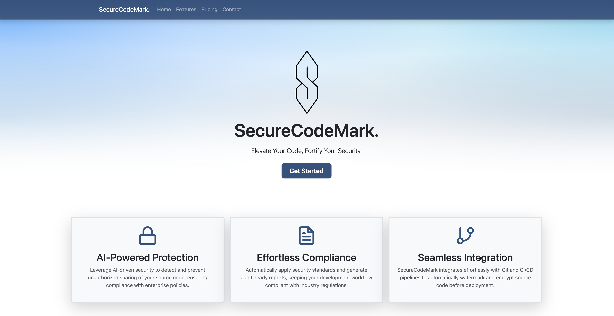

# Hugo Mock Landing Page

**Created By: Praise Ndlovu**

## Summary

Hugo Mock Landing Page is a landing page built using Hugo's static site generator from a Bootstrap template. While this might seem straightforward, the real challenge—and fun—came from having to quickly familiarize myself with a new codebase. With only a few hours to implement meaningful changes, I had to rapidly adapt and make informed decisions.

## What I Learned

- Developed the ability to work in public and navigate the scrutiny that comes with it.
- Learned to quickly adapt to new web development tools and technologies through exploration and experimentation.
- Gained experience in ramping up on unfamiliar codebases and technologies through self-directed research.
- Practiced gathering functional requirements and drafting user stories to conceptualize key website features.
- Enhanced UI/UX design skills by customizing page layouts, themes, and visual elements.
- Gained hands-on experience with modern static site generators and Jamstack technologies.
- Learned techniques for validating designs and functional requirements through prototyping and iteration.
- Acquired practical experience in publishing and hosting static websites on platforms like GitHub Pages.
- Practiced communicating technical concepts effectively through writing and illustration.
- Improved collaboration skills by working with version control and managing shared repository workflows.

## Landing Page Features

The following features have been implemented:

- [X] Customized the navigation bar
- [X] Customized the Hero section
- [X] Adjusted the color scheme
- [X] Added a subfooter

